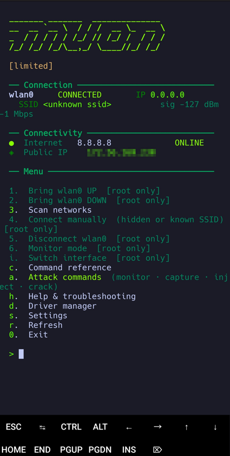

<div align="center">

# Muon

**Terminal WiFi manager for Kali NetHunter, Raspberry Pi, and Termux**

[](https://python.org)
[](https://www.kali.org)
[](https://www.kali.org/kali-nethunter)
[](https://termux.dev)
[](.)

<br>



</div>

---

## Overview

All-green ANSI terminal UI. Single Python 3 script, no pip dependencies.
Two modes — detected automatically at launch based on root access.

| Mode | Platform | Run as |
|------|----------|--------|
| **Full** | Kali NetHunter · Kali Linux · Raspberry Pi | `sudo python3 muon.py` |
| **Limited** | Non-rooted Android via Termux | `python3 muon.py` |

In limited mode all menu items are visible. Root-only actions are grayed out with `[root only]` rather than hidden.

---

## Quick Start

```bash
git clone https://github.com/naturalstate/muon.git
cd muon
sudo python3 muon.py
```

**Full mode — recommended packages**

```bash
apt install wpasupplicant iw wireless-tools usbutils aircrack-ng reaver bettercap kismet wifite
```

**Limited mode (Termux)**

```bash
pkg install termux-api
# Also install the Termux:API companion app from F-Droid (not Play Store)
```

---

## Main Menu

| Key | Action | Full | Limited |
|-----|--------|:----:|:-------:|
| `1` | Bring interface UP | ✓ | — |
| `2` | Bring interface DOWN | ✓ | — |
| `3` | Scan networks — auto-fills BSSID · CHANNEL · SSID as attack target | ✓ | scan only |
| `4` | Connect manually — hidden SSIDs, skips scanning | ✓ | — |
| `5` | Disconnect — kills wpa_supplicant, releases DHCP lease | ✓ | — |
| `6` | Monitor mode — toggle, test injection, interface override | ✓ | — |
| `i` | Switch active interface | ✓ | — |
| `a` | Attack commands — monitor · capture · inject · crack · MITM | ✓ | ✓ |
| `c` | Command reference — 100+ commands across 15 categories | ✓ | ✓ |
| `h` | Help and Troubleshooting — USB adapter guide, driver tips | ✓ | ✓ |
| `d` | Driver manager — detect, match database, install | ✓ | ✓ |
| `s` | Settings — profiles, watchdog, projects, variables | ✓ | ✓ |

---

## Features

### Scan and Attack Target

The scan list shows SSID, channel, signal strength, and encryption status. After the list, two prompts appear independently:

- **Set attack target** — pick a number to copy `BSSID`, `SSID`, and `CHANNEL` directly into the command variables. Every attack command then substitutes those values automatically.
- **Connect** (full mode) — separate prompt. Target and connect can be different networks.

### Monitor Mode

Dedicated screen for the full monitor mode lifecycle:

- Enable / disable via airmon-ng or iw fallback
- Auto-detects the resulting interface name (`wlan1mon`, `wlan1mon0`…) and updates `IFACE_MON` on every entry — catches name drift between sessions
- `d` to disable shows the exact command pre-filled in an editable line so you can correct the interface name before it runs
- `v` to manually override `IFACE_MON` when auto-detection gets it wrong
- Test packet injection against the active monitor interface from within the screen

### Command Reference and Attack Screen

Scrollable library of 100+ commands across 15 categories. Select a command and press Enter — it appears pre-filled in a full keyboard line editor. Arrow keys, Home/End, Ctrl+W / Ctrl+U / Ctrl+K, and backspace all work character by character. Variables such as `{IFACE}`, `{BSSID}`, `{CHANNEL}`, and `{WORDLIST}` are substituted from the current session values before the command runs.

Press a letter key to jump directly to any section. Press `?` to show the full section map.

| Key | Category | Key | Category |
|-----|----------|-----|----------|
| `1` | Diagnostics | `m` | Monitor Mode |
| `2` | Interface Control | `u` | Capture (airodump-ng) |
| `3` | Scanning | `i` | Injection / Deauth |
| `4` | Routing | `w` | Cracking (aircrack-ng, hashcat) |
| `5` | Gateway | `p` | Traffic Capture (tcpdump, tshark) |
| `6` | Static IP | `z` | Kismet |
| `7` | NetworkManager | `n` | Bettercap |
| `8` | nmcli Connections | `x` | WPS Attack (reaver, pixiewps) |
| `9` | nmcli Add Network | `g` | Wifite |
| `0` | Port Forwarding | `t` | Troubleshooting |

Press `a` from the main menu for the attack-only view — same interface, pre-filtered to offensive categories only.

### Command Variables

Variables substitute into every command before it runs. Set them from a scan result, the monitor mode screen, or Settings → Command Variables (`8`).

| Variable | Default | Purpose |
|----------|---------|---------|
| `IFACE` | `wlan1` | Primary wireless adapter |
| `IFACE2` | `wlan0` | Secondary interface |
| `IFACE_MON` | `wlan1mon` | Monitor interface — auto-updated by airmon-ng |
| `BSSID` | _(from scan)_ | Target AP MAC address |
| `CHANNEL` | `6` | Target channel — auto-filled from scan |
| `SSID` | _(from scan)_ | Target network name |
| `WORDLIST` | `/usr/share/wordlists/rockyou.txt` | Cracking wordlist path |
| `GATEWAY` | `192.168.1.1` | Default gateway |
| `IP` | `192.168.1.100` | Static IP address |
| `PORT` | `8080` | Port for forwarding rules |

### Driver Manager

- **Auto-detect** — `lsusb` output matched against a database of common WiFi adapters. Shows chip family, adapter model, monitor-mode support, and whether the kernel module is currently loaded. Offers to install the driver via `apt` or `git clone + make`.
- **Browse adapters** — full scrollable list sorted by chip family, press Enter for detail and install commands.
- **Loaded modules** — `lsmod` filtered for WiFi-related modules plus `iw dev` output.
- **dmesg view** — kernel USB and WiFi messages with errors highlighted.

Supported chips: RTL8812AU, RTL8814AU, RTL8822BU, RTL8821CU, RTL8852BU, RTL8188EUS, RTL8192EU, RTL8723BU, RTL8187L, MT7601U, MT7612U, MT7961U, RT5370, RT3070, RT5572, AR9271, AR9715.

### Projects

Save and restore a complete session state — active interface, all command variables, operating mode, Pi-Tail config, and watchdog settings. Each project is a JSON file in `~/.muon/projects/`. On load, muon shows a summary of what was restored and offers to bring the interface UP immediately.

Access: **Settings → `9`**

### Watchdog

Background thread that checks connectivity every 30 seconds. If the active interface loses its IP or SSID it reconnects using the last saved profile. Optionally lock it to a target SSID — if the interface ends up on the wrong network it reconnects automatically.

### Pi-Tail Keepalive

Monitors a configured interface and keeps it connected to a Pi-Tail hotspot. Auto-reconnects and renews DHCP if the Pi-Tail reboots or the connection drops.

### Saved Profiles

Credentials are saved automatically on every successful connection and used by the watchdog for auto-reconnect. Stored in `~/.muon/profiles.json`.

---

## Typical Attack Workflow

```
Plug in external USB adapter  (e.g. wlan1)
  |
  +-- Main menu  6  (Monitor Mode)  ->  e  (enable)
  |
  +-- Main menu  3  (Scan)  ->  pick target number
  |       BSSID, CHANNEL, SSID auto-filled into all commands
  |
  +-- Main menu  a  (Attack commands)
  |       airodump-ng  ->  Enter  (run, or edit interface first)
  |       aireplay-ng deauth  ->  triggers 4-way handshake
  |       aircrack-ng / hashcat with {WORDLIST}
  |
  +-- For WPS targets:  x  ->  wash to find targets, reaver -K 1 for Pixie Dust
  |
  +-- For MITM:  n  (Bettercap)  ->  wifi.recon, deauth, handshake capture
```

---

## Config

All config in `~/.muon/` — directory permissions `700`, file permissions `600`.

| Path | Contents |
|------|----------|
| `profiles.json` | Saved SSID / password pairs |
| `wpa_<iface>.conf` | Generated wpa_supplicant config |
| `projects/<name>.json` | Named session projects |
